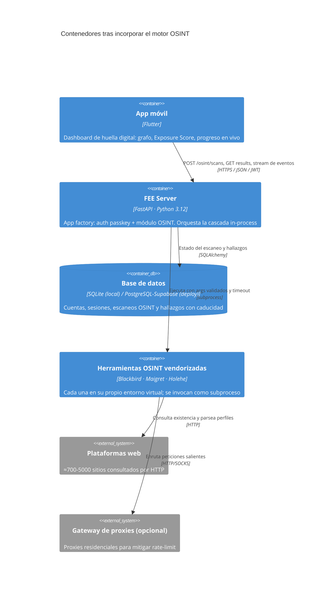
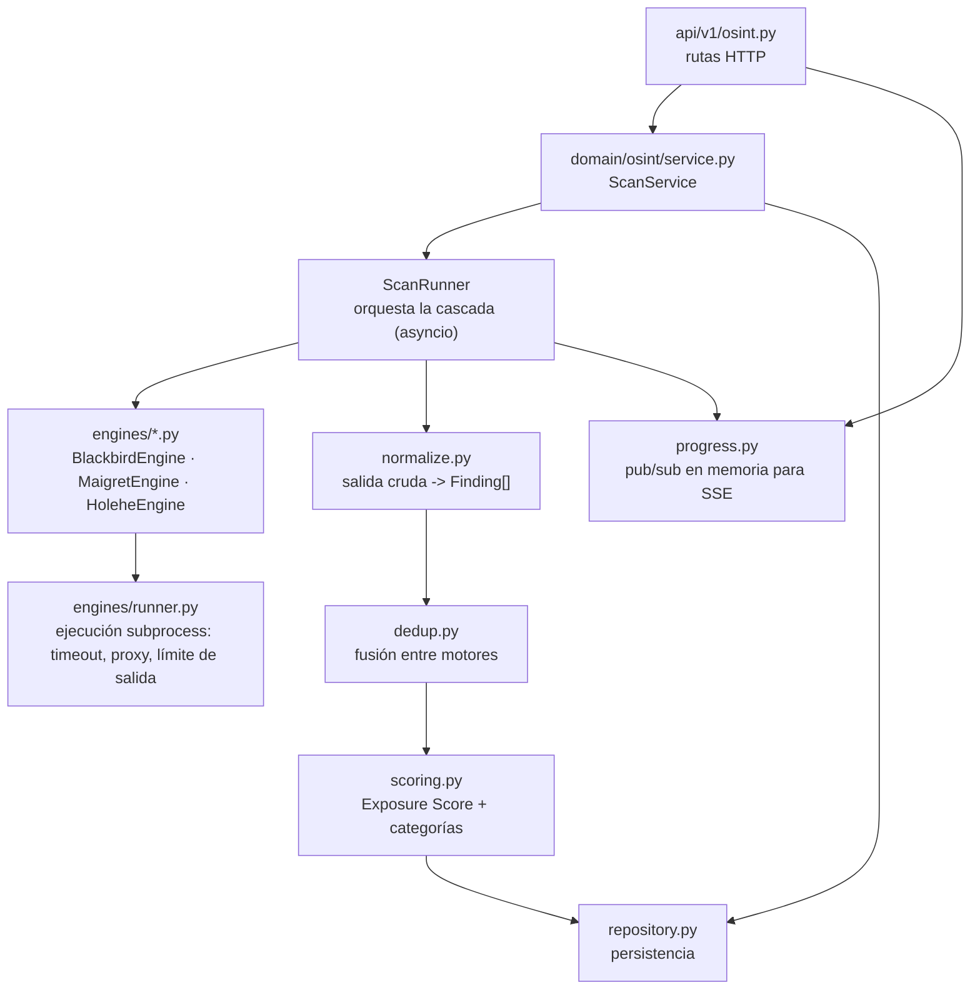
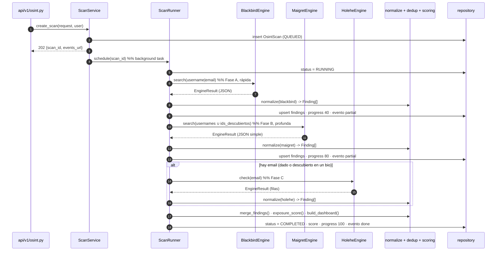

# Arquitectura del motor OSINT (huella digital)

> Estado: **propuesta de diseño**. Ningún endpoint de este documento está
> implementado todavía. Se entrega para revisión antes de escribir código, según
> [el flujo de PR](workflow.md) y [producto y datos](../rules/02-product-and-data.md).

Este documento define cómo el servidor `Hackaton-FEE/server` incorpora un motor
de descubrimiento de huella digital que orquesta tres herramientas open source y
normaliza sus salidas para alimentar un dashboard en la app móvil.

- [herramientas-huella-digital.md](../../hackaton-docs/herramientas-huella-digital.md) y
  [investigacion-e-integracion-herramientas-osint.md](../../hackaton-docs/investigacion-e-integracion-herramientas-osint.md):
  análisis y salidas reales capturadas en laboratorio.
- [especificacion-api-openapi.md](../../hackaton-docs/especificacion-api-openapi.md):
  contrato conceptual del que este diseño toma rutas y payloads.

---

## 1. Alcance

### Dentro

- Dos vectores de entrada: **username/alias** y **correo electrónico**.
- Tres motores: **Blackbird**, **Maigret**, **Holehe**.
- Ejecución asíncrona (`202 Accepted` + progreso), normalización a un esquema
  canónico, deduplicación entre motores, cálculo de un *Exposure Score* y una
  proyección lista para el dashboard móvil.
- Persistencia mínima del trabajo (estado del escaneo y hallazgos) ligada a la
  cuenta autenticada, con caducidad.

### Fuera (roadmap, no son dependencias implícitas)

- Vector de archivos y forense de metadatos (ExifTool) → fase posterior.
- Consultas de brechas/leaks (HIBP u otros) → fase posterior.
- Catálogo JustDelete.me y motor de remediación/opt-out → fase posterior.
- Casos reactivos, LPOA, preservación de evidencia, desindexación → otro módulo.
- Rotación de proxies residenciales gestionada por el servidor: se deja un punto
  de configuración, no una implementación.

### Descarte explícito: Sherlock

Sherlock (≈400 sitios, salida CSV, sin *deep scraping*) es un subconjunto
funcional de Blackbird (base WhatsMyName, ≈700 sitios, JSON nativo, categoría
semántica) y Maigret (≈5000 sitios, dossier). Añadirlo solo aporta un tercer
motor que solapa el mismo vector sin cubrir superficie nueva. Holehe ocupa su
lugar aportando el vector correo.

---

## 2. Las tres herramientas y su rol

| Motor | Vector | Cobertura | Profundidad | Salida nativa | Rol en la cascada |
| --- | --- | --- | --- | --- | --- |
| **Blackbird** | username, email | ≈700 (WhatsMyName) | Media: categoría semántica + metadatos ligeros (avatar, nombre) | JSON (`--json`) | Primera pasada rápida y estructurada; descubre alias y pistas para pivotar |
| **Maigret** | username, IDs | ≈5373 | Máxima: `uid`, nombre real, alta, ubicación, followers, grafo | JSON (`-J simple`, `ndjson`) | Dossier profundo sobre los alias confirmados y los IDs nuevos |
| **Holehe** | email | ≈120 | Presencia + fuga parcial (teléfono/correo enmascarados) | CSV / stdout JSON | Cuentas ligadas al correo que ningún motor de username ve |

Las tres son Python, asíncronas y sensibles a *rate-limiting*. Holehe es la más
frágil sin proxy (visto en los tests del laboratorio: gran parte de los sitios
responden `rateLimit: True`); el diseño lo trata como degradación esperada, no
como fallo.

---

## 3. Modelo C4

### 3.1 Contenedores (delta sobre la arquitectura actual)



Diferencia clave con [arquitectura-software-sad-c4.md](../../hackaton-docs/arquitectura-software-sad-c4.md):
ese documento propone Celery + Redis. Para la entrega inicial se usa un
**ejecutor in-process** (ver ADR-OSINT-01); el contrato HTTP es idéntico, de modo
que migrar a un worker externo después no afecta a la app.

### 3.2 Componentes del módulo OSINT



---

## 4. Estructura de archivos

Sigue el patrón de `domain/auth/` (dominio aislado del transporte). Archivos
pequeños, una responsabilidad cada uno.

```
src/fee_server/
  api/v1/
    osint.py                 # rutas: POST /scans, GET /scans/{id}, /results, /events, DELETE
    router.py                # + api_router.include_router(osint_router)
  core/
    config.py                # + bloque OSINT en Settings
  domain/osint/
    __init__.py
    schemas.py               # Pydantic: ScanRequest, ScanAccepted, ScanStatus, DashboardResult
    models.py                # documentación; los modelos ORM viven en db/models.py
    service.py               # ScanService: crea, ejecuta, consulta, borra
    runner.py                # ScanRunner: cascada asyncio + pivoteo + checkpoints
    repository.py            # CRUD de OsintScan / OsintFinding
    normalize.py             # adaptadores salida->Finding, uno por motor
    dedup.py                 # merge_findings(): fusiona por (plataforma, username)
    scoring.py               # exposure_score(), risk_level(), build_dashboard()
    progress.py              # ProgressHub: canales asyncio por scan_id para SSE
    catalog.py               # normalización de nombres de plataforma y categorías
    engines/
      __init__.py
      base.py                # Protocol UsernameEngine / EmailEngine; dataclass EngineResult
      process.py             # run_tool(): subprocess con args-lista, timeout, cap de bytes
      blackbird.py
      maigret.py
      holehe.py
  db/
    models.py                # + OsintScan, OsintFinding
migrations/versions/
  0002_add_osint_tables.py
vendor/osint/
  README.md                  # layout esperado y validación manual del modo real
  setup.sh                   # crea un .venv por herramienta con uv (versiones fijadas)
  .gitignore                 # blackbird/ maigret/ holehe/ los genera setup.sh
tests/osint/
  conftest.py
  fakes.py                   # FakeEngine con salidas de laboratorio
  fixtures/                  # JSON/CSV reales copiados de hackaton-docs/osint_lab/test_runs/
  test_osint_api.py          # contrato HTTP con motores fake
  test_normalize.py
  test_dedup.py
  test_scoring.py
  test_process.py            # timeout, validación de args, cap de salida
```

---

## 5. Contrato HTTP (v1)

Coordinar con `Hackaton-FEE/app` vía la skill [api-contract](../skills/api-contract/SKILL.md).
Todas las rutas requieren `Authorization: Bearer <JWT>`. Errores en
`application/problem+json` (RFC 7807) reusando `core/problem.py`.

### 5.1 `POST /api/v1/osint/scans` → `202 Accepted`

Encola un escaneo para la **identidad del propio usuario** (auto-auditoría).

Request:

```json
{
  "target_type": "username",
  "identifier": "mi_alias",
  "associated_usernames": ["mi_alias2"],
  "associated_email": "mi.correo@example.com",
  "consent_self_audit": true
}
```

- `target_type`: `"username"` | `"email"`.
- `identifier`: obligatorio. Validado contra un patrón estricto por tipo
  (username: `^[A-Za-z0-9._-]{2,64}$`; email: RFC 5322 simple). Si no valida →
  `400 invalid-identifier` (el detalle nunca repite la entrada).
- `associated_usernames` / `associated_email`: opcionales; amplían la cascada.
- `consent_self_audit`: debe ser `true`. Si falta o es `false` →
  `400 consent-required`.

Response:

```json
{
  "scan_id": "b3f0…",
  "status": "QUEUED",
  "estimated_duration_seconds": 90,
  "polling_url": "/api/v1/osint/scans/b3f0…",
  "events_url": "/api/v1/osint/scans/b3f0…/events"
}
```

### 5.2 `GET /api/v1/osint/scans/{scan_id}` → `200 OK`

```json
{
  "scan_id": "b3f0…",
  "status": "RUNNING",
  "progress_percentage": 60,
  "completed_engines": ["blackbird"],
  "running_engines": ["maigret"],
  "partial_findings_count": 12
}
```

`status`: `QUEUED` | `RUNNING` | `COMPLETED` | `FAILED` | `EXPIRED`.
Escaneo de otra cuenta o inexistente → `404 scan-not-found` (no se distingue
"no existe" de "no es tuyo").

### 5.3 `GET /api/v1/osint/scans/{scan_id}/results` → `200 OK`

Proyección para el dashboard. Disponible con `status` `COMPLETED` (o
`RUNNING` con resultados parciales y `partial: true`).

```json
{
  "scan_id": "b3f0…",
  "generated_at": "2026-09-10T12:00:00Z",
  "partial": false,
  "exposure_score": 68,
  "risk_level": "ELEVATED",
  "summary": {
    "platforms_found": 18,
    "high_confidence": 12,
    "potential_matches": 6,
    "rate_limited": 4,
    "engines_run": ["blackbird", "maigret", "holehe"]
  },
  "categories": [
    {
      "name": "coding",
      "color_hex": "#3B82F6",
      "items_count": 4,
      "items": [
        {
          "platform": "GitHub",
          "username": "mi_alias",
          "url": "https://github.com/mi_alias",
          "status": "CONFIRMED",
          "confidence": 0.98,
          "sources": ["blackbird", "maigret"],
          "details": {
            "account_id": "1024025",
            "full_name": "…",
            "avatar_url": "…",
            "creation_date": "2011-09-03T15:26:22Z",
            "location": "Portland, OR",
            "followers": 321694
          }
        }
      ]
    }
  ]
}
```

`status` por hallazgo: `CONFIRMED` | `POTENTIAL_MATCH` | `RATE_LIMITED`.
`risk_level`: `LOW` | `MODERATE` | `ELEVATED` | `HIGH`.

### 5.4 `GET /api/v1/osint/scans/{scan_id}/events` → `text/event-stream`

SSE para la barra de progreso. Eventos: `progress` (porcentaje + motores),
`partial` (nuevo lote de hallazgos), `done`, `error`. La app puede ignorarlo y
usar solo 5.2 (polling). El stream se cierra al llegar a `done`/`error` o a un
límite de duración.

### 5.5 `DELETE /api/v1/osint/scans/{scan_id}` → `204 No Content`

El usuario borra su escaneo y todos sus hallazgos. Idempotente.

### 5.6 Errores nuevos

| Código | HTTP | Cuándo |
| --- | --- | --- |
| `invalid-identifier` | 400 | El identificador no cumple el patrón del tipo |
| `unsupported-target-type` | 400 | `target_type` fuera de la enumeración |
| `consent-required` | 400 | `consent_self_audit` ausente o `false` |
| `scan-not-found` | 404 | No existe o pertenece a otra cuenta |
| `scan-not-ready` | 409 | Se piden `results` de un escaneo `QUEUED` |
| `rate-limited` | 429 | Cuota por cuenta superada (reusa el handler actual) |

---

## 6. Modelo de datos

Tipos portables (SQLite y PostgreSQL), igual que `db/models.py`.

### `OsintScan`

| Columna | Tipo | Nota |
| --- | --- | --- |
| `id` | `String(36)` PK | UUID |
| `user_id` | FK `users.id` `ON DELETE CASCADE` | dueño |
| `target_type` | `String(16)` | `username` \| `email` |
| `identifier_ciphertext` | `LargeBinary` | identificador cifrado (ver §7) |
| `identifier_hint` | `String(16)` | p. ej. `mi_a…` para mostrar en la app |
| `consent_at` | `DateTime(tz)` | sello de la atestación |
| `status` | `String(16)` | máquina de estados de §5.2 |
| `progress` | `Integer` | 0–100 |
| `exposure_score` | `Integer` nullable | |
| `risk_level` | `String(16)` nullable | |
| `engines` | `JSON` | por motor: `{status, started_at, finished_at, error_category}` |
| `created_at` / `completed_at` | `DateTime(tz)` | |
| `expires_at` | `DateTime(tz)` | por defecto `created_at + FEE_OSINT_RETENTION_DAYS` |

### `OsintFinding`

| Columna | Tipo | Nota |
| --- | --- | --- |
| `id` | `String(36)` PK | |
| `scan_id` | FK `osint_scan.id` `ON DELETE CASCADE` | |
| `platform` | `String(120)` | nombre canónico |
| `category` | `String(32)` | `social` \| `coding` \| `gaming` \| `music` \| `hobby` \| `finance` \| `adult` \| `other` |
| `url` | `String(500)` nullable | |
| `username` | `String(120)` nullable | |
| `status` | `String(20)` | `CONFIRMED` \| `POTENTIAL_MATCH` \| `RATE_LIMITED` |
| `confidence` | `Integer` | 0–100 |
| `sources` | `JSON` | `["blackbird","maigret"]` |
| `details` | `JSON` | subconjunto acotado y con allowlist de claves |

No se guarda el HTML crudo de los perfiles ni el JSON completo de los motores;
solo los campos de la allowlist de `details`.

---

## 7. Privacidad y cumplimiento

Aplica [producto y datos](../rules/02-product-and-data.md).

- **Logs sin PII**: solo `scan_id` (UUID interno), nombre de motor, categoría de
  error y contadores. Nunca el identificador, ni URLs de perfiles, ni el
  contenido de `details`. Los ejemplos y fixtures usan datos ficticios o los
  alias públicos ya presentes en `osint_lab/` (`torvalds`, `testdev9988`).
- **Identificador en reposo**: se cifra con una clave derivada de un secreto de
  entorno (`FEE_OSINT_ENC_KEY`, AES-GCM); en claro solo existe durante la
  ejecución del escaneo. La app recupera `identifier_hint` para mostrarlo.
- **Consentimiento**: `consent_self_audit: true` obligatorio; se sella
  `consent_at`. El producto es auto-auditoría; el contrato no ofrece escanear a
  terceros.
- **Retención**: `expires_at` (por defecto 7 días). Una rutina de limpieza
  (`ScanService.purge_expired()`, invocable por cron externo o al crear un
  escaneo) marca `EXPIRED` y borra los `OsintFinding`. Sin *cascade* implícito a
  otras tablas.
- **Cuotas**: `@limiter.limit` por cuenta — p. ej. `5/hour` en `POST /scans`,
  `60/minute` en lecturas. Complementa el límite por IP existente.
- **Salidas de red controladas**: las herramientas solo se ejecutan cuando
  `FEE_OSINT_ENGINE_MODE=real`. En `test` (y en CI) el modo es `fake` y ningún
  subproceso toca la red. La app factory sigue sin ejecutar trabajo externo al
  crearse (§ límites de responsabilidad de [architecture.md](architecture.md)).
- **Sandbox del subproceso**: nunca `shell=True`; argumentos como lista; el
  identificador ya validado por Pydantic se vuelve a validar antes de pasarlo;
  `timeout` con `kill`; límite de bytes de stdout; entorno mínimo explícito; sin
  heredar variables del proceso servidor.

---

## 8. Orquestación: la cascada con pivoteo

`ScanRunner.run(scan)` — todo dentro de un `asyncio.TaskGroup`, con checkpoints
en base de datos y emisión de eventos SSE tras cada fase.



**Pivoteo** (fase A → B): de la salida de Blackbird se extraen usernames
alternativos y `ids_links`; los de confianza alta se añaden al conjunto que
recibe Maigret. Profundidad 1 (sin recursión encadenada) en la entrega inicial;
Maigret se ejecuta con `--no-recursion`.

**Descubrimiento de email** (para fase C): si el usuario no dio correo, se toma
un `masked_email` o un correo en bio expuesto por Maigret. Si no hay ninguno,
Holehe se omite y se registra `engines.holehe.status = "skipped"`.

**Tolerancia a fallos**: cada motor tiene `timeout` propio; un fallo o timeout
marca ese motor como `error`/`degraded` y **no** aborta el escaneo. El resultado
final indica qué motores corrieron. Reintento único con *backoff* solo ante
error de proceso (no ante `rateLimit` de sitios).

---

## 9. Normalización, deduplicación y score

### 9.1 `Finding` canónico

```python
@dataclass(frozen=True)
class Finding:
    platform: str  # nombre canónico (catalog.py)
    category: str  # enum de §6
    url: str | None
    username: str | None
    status: str  # CONFIRMED | POTENTIAL_MATCH | RATE_LIMITED
    confidence: int  # 0-100
    sources: tuple[str, ...]  # motores que lo aportaron
    details: dict  # allowlist de claves
```

Inmutable: cada paso (`normalize` → `dedup` → `scoring`) devuelve nuevas
estructuras, nunca muta las anteriores (regla de inmutabilidad del proyecto).

### 9.2 Mapeo por motor

| Origen | `status` | `confidence` base |
| --- | --- | --- |
| Maigret `Claimed` con `ids` parseados | `CONFIRMED` | 95 |
| Maigret `Claimed` sin `ids` | `CONFIRMED` | 85 |
| Maigret `is_similar: true` | `POTENTIAL_MATCH` | 50 |
| Blackbird `FOUND` | `CONFIRMED` | 80 (+10 si trae `metadata`) |
| Holehe `exists: true` | `CONFIRMED` | 75 |
| Holehe `rateLimit: true` | `RATE_LIMITED` | 0 (no cuenta como hallazgo) |

### 9.3 `merge_findings`

Clave de fusión: `(platform_canónico, username_normalizado)`.
Al fusionar: `sources` = unión; `confidence` = máx + bonificación por
corroboración (`+10`, techo 98 si ≥2 motores independientes); `details` = unión
por clave dando prioridad al motor más profundo (Maigret > Blackbird > Holehe);
`status` = el más fuerte.

### 9.4 Exposure Score (0–100)

Combinación ponderada, documentada y ajustable por constantes en `scoring.py`:

- volumen de cuentas `CONFIRMED` (curva logarítmica, no lineal),
- diversidad de categorías (más categorías = más superficie),
- señales de alto riesgo: cuentas en `finance`/`adult`, correos/teléfonos
  enmascarados expuestos, ubicación real revelada, cuentas con nombre completo
  público,
- antigüedad: cuentas muy viejas e inactivas puntúan como riesgo latente.

`risk_level` se deriva por umbrales (`<25 LOW`, `<50 MODERATE`, `<75 ELEVATED`,
`>=75 HIGH`). Los `POTENTIAL_MATCH` y `RATE_LIMITED` se muestran pero pesan
poco / nada en el score.

---

## 10. Configuración (`Settings`, prefijo `FEE_`)

| Variable | Defecto | Uso |
| --- | --- | --- |
| `FEE_OSINT_ENGINE_MODE` | `fake` | `fake` \| `real`. `test` fuerza `fake` |
| `FEE_OSINT_ENC_KEY` | vacío | clave AES-GCM para el identificador; obligatoria si `mode=real` |
| `FEE_OSINT_RETENTION_DAYS` | `7` | caducidad de escaneos |
| `FEE_OSINT_MAX_CONCURRENT_SCANS` | `2` | escaneos simultáneos por instancia |
| `FEE_OSINT_ENGINE_TIMEOUT_SECONDS` | `120` | presupuesto de reloj de pared por motor (Maigret ×3); el timeout por petición HTTP es fijo (15 s) |
| `FEE_OSINT_MAX_OUTPUT_BYTES` | `5_000_000` | cap de stdout por subproceso |
| `FEE_OSINT_PROXY_URL` | vacío | proxy HTTP/SOCKS para las herramientas |
| `FEE_OSINT_VENDOR_DIR` | `vendor/osint` | raíz de las herramientas; cada una en `<dir>/<nombre>/.venv/bin` |

Validadores: si `FEE_OSINT_ENGINE_MODE=real` y falta `FEE_OSINT_ENC_KEY` o algún
path, la app **no arranca** (mismo patrón que el secreto JWT en producción).

---

## 11. Estrategia de pruebas

[Calidad](../rules/03-quality.md): método/ruta, código HTTP, respuesta
observable y casos de error. Cobertura ≥ 80 %.

- **`FakeEngine`** implementa el `Protocol` de `engines/base.py` y devuelve las
  salidas reales capturadas en `hackaton-docs/osint_lab/test_runs/`
  (copiadas a `tests/osint/fixtures/`). Los tests de API y de orquestación usan
  fakes; **ningún test toca la red**.
- `test_osint_api.py`: flujo completo `202 → polling → results`, cada error de
  §5.6, `DELETE`, aislamiento entre cuentas, cuotas.
- `test_normalize.py`: cada fixture de motor → `Finding[]` esperado, incluida
  la fila `rateLimit` de Holehe y `is_similar` de Maigret.
- `test_dedup.py`: fusión GitHub visto por Blackbird + Maigret → un `Finding`
  con `sources` de dos y `confidence` 98.
- `test_scoring.py`: conjuntos sintéticos → score y `risk_level` esperados;
  monotonía (más cuentas ⇒ score no decrece).
- `test_process.py`: `run_tool()` respeta timeout (mata el proceso), rechaza
  argumentos con metacaracteres, trunca stdout al cap.
- El modo `real` se prueba manualmente contra los alias públicos del laboratorio
  y se documenta en el PR; no entra en CI.

---

## 12. Plan de entrega por fases

Cada fase es un PR pequeño hacia `main` con aceptación observable.

| Fase | Contenido | Aceptación |
| --- | --- | --- |
| **0 · Contrato + scaffolding** ✅ | `schemas.py`, migración `0002`, tablas `osint_scans`/`osint_findings`, rutas reales con datos de motores **simulados** deterministas, `merge_findings`, Exposure Score, esqueleto SSE (polling a BD), errores RFC 7807, cuotas por cuenta. Sin herramientas reales. | `202 → polling → results` verde con datos simulados; 75 pruebas; cobertura 96 %; desbloquea a Flutter |
| **1 · Adapters de motores** ✅ | `vendor/osint/setup.sh` (un venv `uv` por herramienta; Blackbird se clona por commit, Maigret/Holehe de PyPI), `engines/process.py` (subprocess acotado, sin shell), `engines/parsers.py` (salida cruda → `Finding[]`), `engines/real.py` (`BlackbirdEngine`/`MaigretEngine`/`HoleheEngine`), `build_engines` conmuta simulado/real. | `test_parsers`/`test_process`/`test_real_engines` verdes; `test_integration_real` (opt-in, `FEE_OSINT_INTEGRATION=1`) ejecuta la cascada real y verifica corroboración entre motores. 97 pruebas + 1 integración; cobertura 95 %. La ejecución real **no** entra en CI |
| **2 · Orquestación + score** | `ScanRunner` (cascada + pivoteo real usando IDs/alias descubiertos), `--db` persistente de maigret, concurrencia por escaneo, end-to-end `torvalds` documentado | Pivoteo verificado; `test_dedup`/`test_scoring` verdes |
| **3 · Hardening** | Proxy, *backoff*/circuit-breaker, `purge_expired()`, cuotas por cuenta, cifrado del identificador, `DELETE` | `docs/architecture.md` y `docs/auth-contract.md`/OpenAPI al día; checklist de seguridad |
| **4 · Opcional** | Catálogo JustDelete.me para remediación; ExifTool + vector archivos; recursión profundidad 2 | fuera del alcance comprometido |

---

## 13. ADRs

### ADR-OSINT-01 · Ejecutor in-process en vez de Celery + Redis

- **Estado**: propuesto.
- **Contexto**: el SAD conceptual asume Celery + Redis. Las reglas del repo
  piden no añadir colas ni servicios por iniciativa propia y mantener la app
  factory sin trabajo externo. La carga esperada en hackathon es baja
  (pocos escaneos concurrentes, una sola instancia).
- **Decisión**: `ScanRunner` corre en el mismo proceso con `asyncio` y una
  semáforo de `FEE_OSINT_MAX_CONCURRENT_SCANS`. El estado vive en Postgres, no en
  memoria, así que un reinicio no pierde escaneos (quedan `RUNNING` y una rutina
  los marca `FAILED` si superan un TTL). El contrato HTTP (`202` + polling + SSE)
  es el mismo que tendría con un worker externo.
- **Consecuencias**: +simplicidad, cero infra nueva, tests sencillos. −no escala
  horizontalmente y un escaneo pesado compite por el event loop; se mitiga con el
  semáforo y los timeouts. Migrar a ARQ/Celery luego solo cambia la
  implementación de `ScanRunner.schedule()`.

### ADR-OSINT-02 · Herramientas vendorizadas y ejecutadas como subproceso

- **Estado**: aceptado (fase 1).
- **Contexto**: Blackbird no se distribuye como paquete pip (es un repo con
  `blackbird.py` + `data/`). Maigret y Holehe sí, pero arrastran dependencias en
  conflicto entre sí y con el servidor (`curl-cffi`, distintas versiones de
  `aiohttp`/`httpx`). Importarlas en el proceso del servidor contamina
  `uv.lock` y arriesga romper FastAPI.
- **Decisión**: `vendor/osint/setup.sh` crea un entorno virtual por herramienta
  con `uv` (versiones fijadas; Blackbird se clona, Maigret y Holehe se instalan
  de PyPI). El repositorio versiona solo `setup.sh` y el README; los venvs y el
  código de las herramientas quedan ignorados por git. El servidor las invoca
  como subproceso con args validados y parsea su salida. `pyproject.toml` del
  servidor no suma dependencias (el SSE usa `StreamingResponse` de Starlette).
- **Consecuencias**: +aislamiento total de dependencias, +un solo contenedor,
  +`uv.lock` del servidor intacto, +fácil de mockear. −el `Dockerfile` debe
  ejecutar `setup.sh` (con red) al construir la imagen; −actualizar una
  herramienta es cambiar su versión en `setup.sh` y reejecutarlo; −la ejecución
  real solo se valida a mano, no en CI.

### ADR-OSINT-03 · Holehe en lugar de Sherlock

- **Estado**: propuesto.
- **Contexto**: se buscaba un tercer motor. Sherlock solapa el vector username ya
  cubierto por Blackbird y Maigret.
- **Decisión**: incorporar Holehe (vector correo) y descartar Sherlock.
- **Consecuencias**: +cobertura de un segundo pivote de identidad (email→cuentas)
  invisible para los motores de username. −Holehe depende de proxies para
  fiabilidad alta; se asume degradación (`RATE_LIMITED`) como estado de primera
  clase, no como error.

---

## 14. Riesgos y mitigaciones

| Riesgo | Mitigación |
| --- | --- |
| Sitios bloquean por *rate-limit* / Cloudflare | `RATE_LIMITED` como estado; `FEE_OSINT_PROXY_URL`; concurrencia por motor limitada por flags |
| Un escaneo pesado bloquea el event loop | Semáforo de escaneos, `timeout` por motor, subprocesos (no en el loop) |
| Falsos positivos entre motores | `POTENTIAL_MATCH` separado; bonificación de confianza solo con corroboración independiente |
| Herramienta vendorizada rompe al actualizar `wmn-data.json` / `data.json` | Versiones fijadas en `setup.sh` (Blackbird por commit); parsers probados con fixtures reales; `test_integration_real` antes de subir cambios |
| Blackbird resuelve `data/` y escribe `results/`+`blackbird.log` contra el cwd/su propio directorio | El adaptador lo ejecuta con `cwd` en el repo de Blackbird, limpia `results/` antes y después, y lee el informe recién generado; escaneos concurrentes del mismo alias el mismo día se pisan (aceptable con `osint_max_concurrent_scans` bajo) |
| Deriva del esquema de salida de una herramienta | `normalize.py` valida forma y cae a `other`/`skipped` sin romper el escaneo |
| PII en logs por accidente | Logger con allowlist de campos; revisión en el checklist del PR; fixtures con alias públicos |
| Reinicio del servidor con escaneos en curso | Estado en Postgres; barrido que marca `FAILED` los `RUNNING` vencidos |

---

## 15. Cambios de contrato para coordinar con `Hackaton-FEE/app`

- Nuevas rutas de §5 bajo `/api/v1/osint/`.
- Nuevos códigos de error de §5.6 en `application/problem+json`.
- La app debe distinguir `partial: true` (resultados en construcción) de un
  resultado final, y tolerar `RATE_LIMITED` / `POTENTIAL_MATCH` en los ítems.
- SSE es opcional para el cliente; el polling de §5.2 es suficiente para un MVP.
- Un `202` **no** implica que las plataformas confirmaran nada: solo que el
  escaneo quedó encolado (misma disciplina que el resto del contrato).
