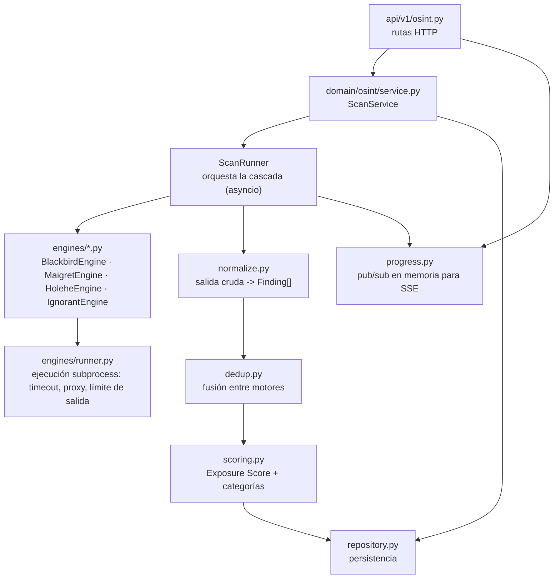
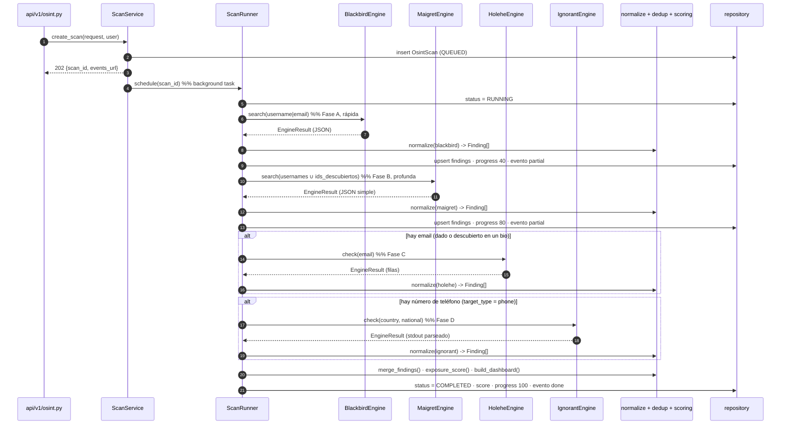

# Arquitectura del motor OSINT (huella digital)

> Estado: **propuesta de diseño**. Ningún endpoint de este documento está
> implementado todavía. Se entrega para revisión antes de escribir código, según
> [el flujo de PR](workflow.md) y [producto y datos](../rules/02-product-and-data.md).

Este documento define cómo el servidor `Hackaton-FEE/server` incorpora un motor
de descubrimiento de huella digital que orquesta tres herramientas open source y
normaliza sus salidas para alimentar un dashboard en la app móvil.

- [herramientas-huella-digital.md](../../hackaton-docs/herramientas-huella-digital.md) y
  [investigacion-e-integracion-herramientas-osint.md](../../hackaton-docs/investigacion-e-integracion-herramientas-osint.md):
  análisis y salidas reales capturadas en laboratorio.
- [especificacion-api-openapi.md](../../hackaton-docs/especificacion-api-openapi.md):
  contrato conceptual del que este diseño toma rutas y payloads.

---

## 1. Alcance

### Dentro

- Vectores de entrada: **username/alias**, **correo electrónico** y **número de
  teléfono** (E.164). El target type **`name`** (nombre completo, admite espacios
  y acentos) se valida y persiste pero todavía no dispara ningún motor: ningún
  motor actual busca por nombre real (pendiente de decidir el consumidor).
- Cuatro motores: **Blackbird**, **Maigret**, **Holehe**, **Ignorant**.
- Ejecución asíncrona (`202 Accepted` + progreso), normalización a un esquema
  canónico, deduplicación entre motores, cálculo de un *Exposure Score* y una
  proyección lista para el dashboard móvil.
- Persistencia mínima del trabajo (estado del escaneo y hallazgos) ligada a la
  cuenta autenticada, con caducidad.

### Fuera (roadmap, no son dependencias implícitas)

- Consultas de brechas/leaks (HIBP u otros) → fase posterior.
- Catálogo JustDelete.me y motor de remediación/opt-out → fase posterior.
- Casos reactivos, LPOA, preservación de evidencia, desindexación → otro módulo.
- Rotación de proxies residenciales gestionada por el servidor: se deja un punto
  de configuración, no una implementación.

### Descarte explícito: Sherlock

Sherlock (≈400 sitios, salida CSV, sin *deep scraping*) es un subconjunto
funcional de Blackbird (base WhatsMyName, ≈700 sitios, JSON nativo, categoría
semántica) y Maigret (≈5000 sitios, dossier). Añadirlo solo aporta un tercer
motor que solapa el mismo vector sin cubrir superficie nueva. Holehe ocupa su
lugar aportando el vector correo.

---

## 2. Las cuatro herramientas y su rol

| Motor | Vector | Cobertura | Profundidad | Salida nativa | Rol en la cascada |
| --- | --- | --- | --- | --- | --- |
| **Blackbird** | username, email | ≈700 (WhatsMyName) | Media: categoría semántica + metadatos ligeros (avatar, nombre) | JSON (`--json`) | Primera pasada rápida y estructurada; descubre alias y pistas para pivotar |
| **Maigret** | username, IDs | ≈5373 | Máxima: `uid`, nombre real, alta, ubicación, followers, grafo | JSON (`-J simple`, `ndjson`) | Dossier profundo sobre los alias confirmados y los IDs nuevos |
| **Holehe** | email | ≈120 | Presencia + fuga parcial (teléfono/correo enmascarados) | CSV / stdout JSON | Cuentas ligadas al correo que ningún motor de username ve |
| **Ignorant** | phone | 3 (Amazon, Instagram, Snapchat) | Presencia | stdout (`[+]`/`[-]`/`[x]` por dominio) | Cuentas ligadas a un número de teléfono E.164 |

Las cuatro son Python, asíncronas y sensibles a *rate-limiting*. Holehe e Ignorant
usan la técnica de *account-recovery* y son las más frágiles sin proxy (gran parte
de los sitios responden `rateLimit: True` desde IPs de datacenter); el diseño lo
trata como degradación esperada, no como fallo. `FEE_OSINT_PROXY_URL` es el punto
de enganche para un proxy HTTP/SOCKS.

---

## 3. Modelo C4

### 3.1 Contenedores (delta sobre la arquitectura actual)


Diferencia clave con [arquitectura-software-sad-c4.md](../../hackaton-docs/arquitectura-software-sad-c4.md):
ese documento propone Celery + Redis. Para la entrega inicial se usa un
**ejecutor in-process** (ver ADR-OSINT-01); el contrato HTTP es idéntico, de modo
que migrar a un worker externo después no afecta a la app.

### 3.2 Componentes del módulo OSINT



---

## 4. Estructura de archivos

Sigue el patrón de `domain/auth/` (dominio aislado del transporte). Archivos
pequeños, una responsabilidad cada uno.

```
src/fee_server/
  api/v1/
    osint.py                 # rutas: POST /scans, GET /scans/{id}, /results, /events, DELETE
    router.py                # + api_router.include_router(osint_router)
  core/
    config.py                # + bloque OSINT en Settings
  domain/osint/
    __init__.py
    schemas.py               # Pydantic: ScanRequest, ScanAccepted, ScanStatus, DashboardResult
    models.py                # documentación; los modelos ORM viven en db/models.py
    service.py               # ScanService: crea, ejecuta, consulta, borra
    runner.py                # ScanRunner: cascada asyncio + pivoteo + checkpoints
    repository.py            # CRUD de OsintScan / OsintFinding
    normalize.py             # adaptadores salida->Finding, uno por motor
    dedup.py                 # merge_findings(): fusiona por (plataforma, username)
    scoring.py               # exposure_score(), risk_level(), build_dashboard()
    progress.py              # ProgressHub: canales asyncio por scan_id para SSE
    catalog.py               # normalización de nombres de plataforma y categorías
    engines/
      __init__.py
      base.py                # Protocol UsernameEngine / EmailEngine; dataclass EngineResult
      process.py             # run_tool(): subprocess con args-lista, timeout, cap de bytes
      blackbird.py
      maigret.py
      holehe.py
      ignorant.py
  db/
    models.py                # + OsintScan, OsintFinding
migrations/versions/
  0002_add_osint_tables.py
vendor/osint/
  README.md                  # layout esperado y validación manual del modo real
  setup.sh                   # crea un .venv por herramienta con uv (versiones fijadas)
  .gitignore                 # blackbird/ maigret/ holehe/ ignorant/ los genera setup.sh
tests/osint/
  conftest.py
  fakes.py                   # FakeEngine con salidas de laboratorio
  fixtures/                  # JSON/CSV reales copiados de hackaton-docs/osint_lab/test_runs/
  test_osint_api.py          # contrato HTTP con motores fake
  test_normalize.py
  test_dedup.py
  test_scoring.py
  test_process.py            # timeout, validación de args, cap de salida
```

---

## 5. Contrato HTTP (v1)

Coordinar con `Hackaton-FEE/app` vía la skill [api-contract](../skills/api-contract/SKILL.md).
Todas las rutas requieren `Authorization: Bearer <JWT>`. Errores en
`application/problem+json` (RFC 7807) reusando `core/problem.py`.

### 5.1 `POST /api/v1/osint/scans` → `202 Accepted`

Encola un escaneo para la **identidad del propio usuario** (auto-auditoría).

Request:

```json
{
  "target_type": "username",
  "identifier": "mi_alias",
  "associated_usernames": ["mi_alias2"],
  "associated_email": "mi.correo@example.com",
  "consent_self_audit": true
}
```

- `target_type`: `"username"` | `"email"` | `"name"` | `"phone"`.
- `identifier`: obligatorio. Validado contra un patrón estricto por tipo
  (username: `^[A-Za-z0-9._-]{2,64}$`; email: RFC 5322 simple; name: empieza por
  letra Unicode y admite espacios, `.`, `'`, `-`, 2-80 chars; phone: E.164
  `^\+[1-9]\d{7,14}$`). Si no valida → `400 invalid-identifier` (el detalle nunca
  repite la entrada).
- `associated_usernames` / `associated_email`: opcionales; amplían la cascada.
- `consent_self_audit`: `true` para el camino de **auto-auditoría**.
- `consent_token`: alternativa para el camino de **escaneo de terceros
  consentido** (solo `target_type: "email"`). Lo emite
  `POST /api/v1/verification/email/confirm` (§5.7) tras probar el titular que
  controla el buzón. El servidor comprueba que el token está firmado, no ha
  caducado y corresponde a `sha256(identifier)`.
- Debe llegar **uno** de los dos: sin `consent_self_audit: true` ni un
  `consent_token` válido → `400 consent-required`. Un `consent_token` con
  `target_type` distinto de `email` → `400 invalid-identifier`. Un
  `consent_token` inválido, caducado o de otro correo → `403 invalid-consent`.

Response:

```json
{
  "scan_id": "b3f0…",
  "status": "QUEUED",
  "estimated_duration_seconds": 90,
  "polling_url": "/api/v1/osint/scans/b3f0…",
  "events_url": "/api/v1/osint/scans/b3f0…/events"
}
```

### 5.2 `GET /api/v1/osint/scans/{scan_id}` → `200 OK`

```json
{
  "scan_id": "b3f0…",
  "status": "RUNNING",
  "progress_percentage": 60,
  "completed_engines": ["blackbird"],
  "running_engines": ["maigret"],
  "partial_findings_count": 12
}
```

`status`: `QUEUED` | `RUNNING` | `COMPLETED` | `FAILED` | `EXPIRED`.
Escaneo de otra cuenta o inexistente → `404 scan-not-found` (no se distingue
"no existe" de "no es tuyo").

### 5.3 `GET /api/v1/osint/scans/{scan_id}/results` → `200 OK`

Proyección para el dashboard. Disponible con `status` `COMPLETED` (o
`RUNNING` con resultados parciales y `partial: true`).

```json
{
  "scan_id": "b3f0…",
  "generated_at": "2026-09-10T12:00:00Z",
  "partial": false,
  "exposure_score": 68,
  "risk_level": "ELEVATED",
  "summary": {
    "platforms_found": 18,
    "high_confidence": 12,
    "potential_matches": 6,
    "rate_limited": 4,
    "engines_run": ["blackbird", "maigret", "holehe", "ignorant"]
  },
  "correlation": {
    "identity_graph": {
      "nodes": [{ "id": "GitHub:mi_alias", "platform": "GitHub", "username": "mi_alias", "category": "coding" }],
      "edges": [{ "source": "GitHub:mi_alias", "target": "GitLab:mi_alias", "shared": ["full_name", "username"], "weight": 2 }],
      "clusters": [["GitHub:mi_alias", "GitLab:mi_alias"]]
    },
    "timeline": {
      "entries": [{ "platform": "GitHub", "username": "mi_alias", "created_at": "2011-09-03T15:26:22+00:00", "age_years": 15.0 }],
      "oldest_platform": "GitHub",
      "oldest_date": "2011-09-03T15:26:22+00:00",
      "newest_platform": "Reddit",
      "newest_date": "2021-04-10T00:00:00+00:00",
      "span_years": 9.6,
      "dormant_old_accounts": ["GitHub"]
    },
    "reconstructed_contacts": [
      { "kind": "email", "pattern": "m***@e***.com", "sources": ["holehe"], "count": 1, "consistent_with_provided": true }
    ]
  },
  "categories": [
    {
      "name": "coding",
      "color_hex": "#3B82F6",
      "items_count": 4,
      "items": [
        {
          "platform": "GitHub",
          "username": "mi_alias",
          "url": "https://github.com/mi_alias",
          "status": "CONFIRMED",
          "confidence": 0.98,
          "sources": ["blackbird", "maigret"],
          "details": {
            "account_id": "1024025",
            "full_name": "…",
            "avatar_url": "…",
            "creation_date": "2011-09-03T15:26:22Z",
            "location": "Portland, OR",
            "followers": 321694
          }
        }
      ]
    }
  ]
}
```

`status` por hallazgo: `CONFIRMED` | `POTENTIAL_MATCH` | `RATE_LIMITED`.
`risk_level`: `LOW` | `MODERATE` | `ELEVATED` | `HIGH`.

### 5.4 `GET /api/v1/osint/scans/{scan_id}/events` → `text/event-stream`

SSE para la barra de progreso. Eventos: `progress` (porcentaje + motores),
`partial` (nuevo lote de hallazgos), `done`, `error`. La app puede ignorarlo y
usar solo 5.2 (polling). El stream se cierra al llegar a `done`/`error` o a un
límite de duración.

### 5.5 `DELETE /api/v1/osint/scans/{scan_id}` → `204 No Content`

El usuario borra su escaneo y todos sus hallazgos. Idempotente.

### 5.7 Verificación de correo (consentimiento de terceros)

Ambas rutas requieren `Authorization: Bearer <JWT>` (la cuenta que solicita el
escaneo). Flujo sin estado: nada se persiste, todo viaja en tokens firmados
HMAC-SHA256 (`core/security/signed_token.py`, mismo patrón que el reto WebAuthn).

`POST /api/v1/verification/email/request` → `200 OK`

```json
{ "email": "titular@example.com" }
→ { "verification_token": "7b22…​.a1b2…", "expires_in": 600 }
```

`POST /api/v1/verification/email/confirm` → `200 OK`

```json
{ "verification_token": "7b22…​.a1b2…", "code": "1234" }
→ { "consent_token": "7b22…​.c3d4…", "expires_in": 3600 }
```

**Hackathon**: el código es estático (`FEE_VERIFICATION_STATIC_CODE`, por defecto
`"1234"`) y no se envía ningún correo. La costura para hacerlo funcional (código
aleatorio + `EmailSender`) está descrita en `domain/verification/service.py`;
son cuatro cambios localizados que no tocan este contrato.

### 5.6 Errores nuevos

| Código | HTTP | Cuándo |
| --- | --- | --- |
| `invalid-identifier` | 400 | El identificador no cumple el patrón del tipo, o hay `consent_token` con `target_type` ≠ `email` |
| `unsupported-target-type` | 400 | `target_type` fuera de la enumeración |
| `consent-required` | 400 | Ni `consent_self_audit: true` ni un `consent_token` válido |
| `invalid-verification-token` | 400 | `verification_token` manipulado, caducado o con correo inválido |
| `invalid-verification-code` | 400 | El código no coincide |
| `invalid-consent` | 403 | `consent_token` inválido, caducado o de otro correo |
| `scan-not-found` | 404 | No existe o pertenece a otra cuenta |
| `scan-not-ready` | 409 | Se piden `results` de un escaneo `QUEUED` |
| `rate-limited` | 429 | Cuota por cuenta superada (reusa el handler actual) |

---

## 6. Modelo de datos

Tipos portables (SQLite y PostgreSQL), igual que `db/models.py`.

### `OsintScan`

| Columna | Tipo | Nota |
| --- | --- | --- |
| `id` | `String(36)` PK | UUID |
| `user_id` | FK `users.id` `ON DELETE CASCADE` | dueño |
| `target_type` | `String(16)` | `username` \| `email` \| `name` \| `phone` |
| `identifier_ciphertext` | `LargeBinary` | identificador cifrado (ver §7) |
| `identifier_hint` | `String(16)` | p. ej. `mi_a…` para mostrar en la app |
| `consent_at` | `DateTime(tz)` | sello de la atestación |
| `status` | `String(16)` | máquina de estados de §5.2 |
| `progress` | `Integer` | 0–100 |
| `exposure_score` | `Integer` nullable | |
| `risk_level` | `String(16)` nullable | |
| `engines` | `JSON` | por motor: `{status, started_at, finished_at, error_category}` |
| `correlation` | `JSON` nullable | capa de correlación (§9.5): grafo de identidad, timeline y contactos reconstruidos. Se calcula al completar el escaneo y se borra al caducar |
| `created_at` / `completed_at` | `DateTime(tz)` | |
| `expires_at` | `DateTime(tz)` | por defecto `created_at + FEE_OSINT_RETENTION_DAYS` |

### `OsintFinding`

| Columna | Tipo | Nota |
| --- | --- | --- |
| `id` | `String(36)` PK | |
| `scan_id` | FK `osint_scan.id` `ON DELETE CASCADE` | |
| `platform` | `String(120)` | nombre canónico |
| `category` | `String(32)` | `social` \| `coding` \| `gaming` \| `music` \| `hobby` \| `finance` \| `adult` \| `other` |
| `url` | `String(500)` nullable | |
| `username` | `String(120)` nullable | |
| `status` | `String(20)` | `CONFIRMED` \| `POTENTIAL_MATCH` \| `RATE_LIMITED` |
| `confidence` | `Integer` | 0–100 |
| `sources` | `JSON` | `["blackbird","maigret"]` |
| `details` | `JSON` | subconjunto acotado y con allowlist de claves |

No se guarda el HTML crudo de los perfiles ni el JSON completo de los motores;
solo los campos de la allowlist de `details`.

---

## 7. Privacidad y cumplimiento

Aplica [producto y datos](../rules/02-product-and-data.md).

- **Logs sin PII**: solo `scan_id` (UUID interno), nombre de motor, categoría de
  error y contadores. Nunca el identificador, ni URLs de perfiles, ni el
  contenido de `details`. Los ejemplos y fixtures usan datos ficticios o los
  alias públicos ya presentes en `osint_lab/` (`torvalds`, `testdev9988`).
- **Identificador en reposo**: se cifra con una clave derivada de un secreto de
  entorno (`FEE_OSINT_ENC_KEY`, AES-GCM); en claro solo existe durante la
  ejecución del escaneo. La app recupera `identifier_hint` para mostrarlo.
- **Consentimiento**: dos caminos, se sella `consent_at` en ambos.
  1. *Auto-auditoría*: `consent_self_audit: true`.
  2. *Terceros consentido* (solo `target_type: email`): un `consent_token`
     firmado que prueba que el titular del correo controla el buzón (§5.7 y
     ADR-OSINT-05). Sin ese token no se puede escanear un correo ajeno.
  El correo del tercero nunca se persiste en claro: solo `identifier_sha256` e
  `identifier_hint`, igual que en el camino propio. El token es sin estado
  (`domain/verification/`); no hay tabla ni PII de terceros en la base de datos.
  **Alcance del consentimiento y pivoteo**: decisión de producto — el
  consentimiento (en cualquiera de los dos caminos) cubre **toda la
  búsqueda de huella digital** resultante, no solo el identificador literal
  dado. El pivoteo (§8) puede por tanto escanear alias que Maigret descubre
  enlazados al perfil consentido, también en el camino de terceros; sigue
  acotado (`FEE_OSINT_MAX_PIVOT_CANDIDATES`, profundidad 1) y sujeto a la
  misma regla de reducción de ruido que cualquier otro hallazgo (§9.7).
- **Retención**: `expires_at` (por defecto 7 días). Una rutina de limpieza
  (`ScanService.purge_expired()`, invocable por cron externo o al crear un
  escaneo) marca `EXPIRED` y borra los `OsintFinding`. Sin *cascade* implícito a
  otras tablas.
- **Cuotas**: `@limiter.limit` por cuenta — p. ej. `5/hour` en `POST /scans`,
  `60/minute` en lecturas. Complementa el límite por IP existente.
- **Salidas de red controladas**: las herramientas solo se ejecutan cuando
  `FEE_OSINT_ENGINE_MODE=real`. En `test` (y en CI) el modo es `fake` y ningún
  subproceso toca la red. La app factory sigue sin ejecutar trabajo externo al
  crearse (§ límites de responsabilidad de [architecture.md](architecture.md)).
- **Sandbox del subproceso**: nunca `shell=True`; argumentos como lista; el
  identificador ya validado por Pydantic se vuelve a validar antes de pasarlo;
  `timeout` con `kill`; límite de bytes de stdout; entorno mínimo explícito; sin
  heredar variables del proceso servidor.

---

## 8. Orquestación: la cascada con pivoteo

`ScanRunner.run(scan)` — todo dentro de un `asyncio.TaskGroup`, con checkpoints
en base de datos y emisión de eventos SSE tras cada fase.



**Pivoteo** (`domain/osint/pivot.py` + `runner.py`, entregado en D2.5) —
**desviación deliberada** de la Fase A→B descrita arriba: en vez de cablear
"Blackbird alimenta a Maigret" específicamente (hoy Blackbird no extrae
`ids_links`/`ids_usernames`, pendiente de auditoría real; ver D1.5), el diseño
es genérico. Tras la Fase 1 completa (los 4 motores sobre el identificador
original), `extract_pivot_candidates` recoge `linked_usernames` de los
hallazgos `CONFIRMED`, excluye los alias ya consultados, **valida cada uno
con `catalog.is_valid_identifier` como si viniera de la API** (son datos
raspados de un perfil de terceros, una frontera de confianza distinta a la
del propio usuario) y recorta a `FEE_OSINT_MAX_PIVOT_CANDIDATES` (3 por
defecto). Si hay candidatos, una **Fase 2** vuelve a correr Blackbird y
Maigret (los únicos motores por username) con esos alias. Profundidad 1 por
construcción: los hallazgos de la Fase 2 nunca se inspeccionan para sacar más
candidatos — no hay un tercer bucle, ni un contador de profundidad que se
pueda subir sin querer. `scan.engines` conserva siempre las 4 claves
canónicas (un motor que corre en ambas fases agrega su conteo de hallazgos,
sin pseudo-motores tipo `"blackbird_pivot"`); el progreso reserva 70-95 para
la Fase 2 y salta directo a 100 si no hubo candidatos. Los hallazgos
pivotados pasan por la misma regla de reducción de ruido que cualquier otro
(§9.7) desde el primer momento.

**Descubrimiento de email** (para fase C): si el usuario no dio correo, se toma
un `masked_email` o un correo en bio expuesto por Maigret. Si no hay ninguno,
Holehe se omite y se registra `engines.holehe.status = "skipped"`.

**Vector de teléfono** (fase D): solo se ejecuta Ignorant cuando
`target_type = phone`. El identificador E.164 se divide en (código de país,
número nacional) con `catalog.split_phone` (apoyado en `phonenumbers`). Sin
número, `engines.ignorant.status = "skipped"`.

**Tolerancia a fallos**: cada motor tiene `timeout` propio; un fallo o timeout
marca ese motor como `error`/`degraded` y **no** aborta el escaneo. El resultado
final indica qué motores corrieron. Reintento único con *backoff* solo ante
error de proceso (no ante `rateLimit` de sitios).

---

## 9. Normalización, deduplicación y score

### 9.1 `Finding` canónico

```python
@dataclass(frozen=True)
class Finding:
    platform: str  # nombre canónico (catalog.py)
    category: str  # enum de §6
    url: str | None
    username: str | None
    status: str  # CONFIRMED | POTENTIAL_MATCH | RATE_LIMITED
    confidence: int  # 0-100
    sources: tuple[str, ...]  # motores que lo aportaron
    details: dict  # allowlist de claves
```

Inmutable: cada paso (`normalize` → `dedup` → `scoring`) devuelve nuevas
estructuras, nunca muta las anteriores (regla de inmutabilidad del proyecto).

### 9.2 Mapeo por motor

| Origen | `status` | `confidence` base |
| --- | --- | --- |
| Maigret `Claimed` con `ids` parseados | `CONFIRMED` | 95 |
| Maigret `Claimed` sin `ids` | `CONFIRMED` | 85 |
| Maigret `is_similar: true` | `POTENTIAL_MATCH` | 50 |
| Blackbird `FOUND` | `CONFIRMED` | 80 (+10 si trae `metadata`) |
| Holehe `exists: true` | `CONFIRMED` | 75 |
| Holehe `rateLimit: true` | `RATE_LIMITED` | 0 (no cuenta como hallazgo) |
| Ignorant `[+]` (usado) | `CONFIRMED` | 70 |
| Ignorant `[x]` (rate limit) | `RATE_LIMITED` | 0 (no cuenta como hallazgo) |

### 9.3 `merge_findings`

Clave de fusión: `(platform_canónico, username_normalizado)`.
Al fusionar: `sources` = unión; `confidence` = máx + bonificación por
corroboración (`+10`, techo 98 si ≥2 motores independientes); `details` = unión
por clave dando prioridad al motor más profundo (Maigret > Blackbird > Holehe/Ignorant);
`status` = el más fuerte.

### 9.4 Exposure Score (0–100)

Combinación ponderada, documentada y ajustable por constantes en `scoring.py`:

- volumen de cuentas `CONFIRMED` (curva logarítmica, no lineal),
- diversidad de categorías (más categorías = más superficie),
- señales de alto riesgo: cuentas en `finance`/`adult`, correos/teléfonos
  enmascarados expuestos, ubicación real revelada, cuentas con nombre completo
  público,
- antigüedad: cuentas muy viejas e inactivas puntúan como riesgo latente.

`risk_level` se deriva por umbrales (`<25 LOW`, `<50 MODERATE`, `<75 ELEVATED`,
`>=75 HIGH`). Los `POTENTIAL_MATCH` y `RATE_LIMITED` se muestran pero pesan
poco / nada en el score.

### 9.5 Correlación (`correlation.py`)

Capa de solo lectura sobre los `Finding[]` ya deduplicados. Funciones puras y
deterministas, sin red ni dependencias nuevas; `correlate()` corre una vez al
completar el escaneo y su resultado se persiste en `OsintScan.correlation`. No
altera el `exposure_score` (previsto para una fase posterior). Tres señales:

- **Grafo de identidad**: un nodo por cuenta `CONFIRMED` con username; una arista
  entre dos cuentas que comparten un valor casefold no vacío de `full_name`,
  `location`, `company` o `username`, **o** que se referencian explícitamente
  vía `linked_usernames` (arista `shared=("linked_usernames",)`, munición de
  pivoteo que Maigret ya calcula en `ids_links`/`ids_usernames`). Las
  componentes conexas de tamaño ≥ 2 son los *clústeres* de identidad. Responde
  "¿qué cuentas están demostrablemente ligadas a la misma persona?".
- **Timeline de antigüedad**: a partir de `creation_date` (ISO 8601; una fecha
  ilegible se ignora sin romper). Devuelve entradas ordenadas y `oldest`/`newest`,
  `span_years` y `dormant_old_accounts` (creadas hace ≥ 5 años).
- **Contactos reconstruidos**: agrupa los `masked_email` / `masked_phone` que
  varios sitios exponen; por grupo da `pattern`, `sources`, `count` y, si el
  usuario aportó correo, `consistent_with_provided`.

Privacidad: no introduce datos crudos nuevos (solo cruza `details` ya
persistidos), no registra nada, y se borra junto con los hallazgos al caducar
el escaneo (§7).

### 9.6 Dos fronteras de `details` (`findings.py`)

`DETAIL_KEYS` es el límite de **"esto no es basura"**: todo lo que entra ahí
fluye por el pipeline interno (`normalize → merge → grafo de identidad →
reducción de ruido → score`). No todo lo que pasa ese primer filtro es
apropiado para mostrarlo a un humano en la app — `linked_usernames` (cuentas
relacionadas que Maigret descubre, munición de pivoteo) es deliberadamente
**interno**: alimenta el grafo, pero su versión "filtrada para la app" es la
arista ya procesada del grafo, no el dato crudo.

`PUBLIC_DETAIL_KEYS = DETAIL_KEYS - {"linked_usernames"}` es lo único que sale
del sistema. Se aplica en un único punto,
`repository.py::replace_findings` (`project_public_details`), justo antes de
escribir `OsintFinding.details` — como `service.py::build_results` siempre
reconstruye `Finding` a partir de filas ya persistidas, filtrar ahí basta para
que ninguna lectura futura (polling, `GET .../results`) vuelva a exponer un
campo interno.

### 9.7 Reducción de ruido (`noise.py`)

"La cuenta existe" no prueba "es tuya" cuando el alias es genérico — un
`CONFIRMED` se degrada a `POTENTIAL_MATCH` **solo si fallan las tres
condiciones a la vez** (regla conservadora):

1. el alias es común (heurística: en una stoplist pequeña, < 8 caracteres, o
   sin dígitos/separadores — `is_common_username`, deliberadamente imperfecta:
   el respaldo real son las otras dos condiciones);
2. no trae ningún detalle rico **autodescriptivo** (`full_name`, `location`,
   `account_id`, `company`, `following_count`, `repos_count`, `bio_links`).
   `linked_usernames` queda fuera de esta lista a propósito: es una
   afirmación del propio hallazgo ("enlazo a esta otra cuenta"), no un dato
   sobre la cuenta en sí — sin verificar que esa cuenta exista de verdad en
   el escaneo no prueba nada, y contarlo aquí dejaría que cualquier hallazgo
   se auto-declarara "rico" sin corroboración genuina;
3. no está enlazado a ninguna otra cuenta del escaneo en el grafo de
   identidad — **excluyendo** las aristas que solo comparten `username` (dos
   alias comunes idénticos no pueden "corroborarse" el uno al otro, sería
   circular). Esta es la única vía por la que `linked_usernames` sí cuenta:
   cuando forma una arista real (`shared=("linked_usernames",)`) contra otra
   cuenta que de verdad está en el escaneo.

`ScanRunner.run_scan` construye el grafo sobre el conjunto crudo (para que un
hallazgo pueda salvarse si otra cuenta lo corrobora), degrada, y **luego**
calcula `exposure_score` y recalcula la correlación final sobre el conjunto ya
limpio.

### 9.8 Forense EXIF sobre `avatar_url` (D2.6)

Tras `merge_findings` y antes del grafo de identidad, `enrich_with_image_metadata`
(`enrichment.py`) recorre los `CONFIRMED` con `avatar_url` y les añade, si los
hay, `image_gps_location` (decimal `"lat,lon"`), `image_camera_model` y
`image_taken_at` — extraídos del EXIF real de la imagen, no autodeclarados por
el perfil, así que cuentan como evidencia "rica" en `noise.py` igual que
`full_name`/`location`. Dos módulos con fronteras separadas:

- **`image_fetch.py`**: descarga acotada, sin escribir nunca a disco (los
  bytes viven en memoria el tiempo mínimo). Barrera SSRF con *pinning*: se
  resuelve el host una sola vez (`_resolve_pinned_ip`), se rechaza si
  cualquier IP resuelta es privada/loopback/link-local/multicast/reservada,
  y la petición se hace literalmente contra esa IP (no contra el hostname —
  `httpx` no vuelve a resolver el DNS), con `Host`/SNI puestos aparte al
  hostname original vía la extensión `sni_hostname`. Esto cierra el
  DNS-rebinding (TTL≈0, IP distinta entre la validación y la conexión) que
  un guard "resolver y luego conectar por hostname" no puede evitar. Sin
  seguir redirecciones, tope de bytes verificado **mientras se descarga**
  (`FEE_OSINT_IMAGE_MAX_BYTES`, no confía en `Content-Length`), tope de
  **reloj de pared completo** además del timeout por-operación de httpx (un
  servidor que gotea bytes justo por debajo del timeout de cada lectura no
  puede alargar la descarga sin límite), y reusa
  `effective_osint_normal_proxy` (mismo proxy que Blackbird; si falta en
  producción, se loguea un warning explícito en vez de fallar en silencio).
- **`image_metadata.py`**: puro, sin red; abre los bytes con Pillow y
  extrae como mucho esas tres claves (no un volcado completo del EXIF).
  Cualquier byte que no sea una imagen válida, o un EXIF ilegible, produce
  `{}` sin lanzar — un avatar corrupto o malicioso no debe tumbar el
  enriquecimiento ni el escaneo.

`FEE_OSINT_IMAGE_METADATA_ENABLED=0` apaga el módulo por completo (el
`runner` se comporta como si ningún hallazgo trajera `avatar_url`). En
`environment=test` o `FEE_OSINT_ENGINE_MODE=fake`, `build_image_fetcher`
devuelve un `FakeImageFetcher` determinista (una imagen 1×1 generada en
memoria con EXIF fijo) — ningún test toca la red.

---

## 10. Configuración (`Settings`, prefijo `FEE_`)

| Variable | Defecto | Uso |
| --- | --- | --- |
| `FEE_OSINT_ENGINE_MODE` | `fake` | `fake` \| `real`. `test` fuerza `fake` |
| `FEE_OSINT_ENC_KEY` | vacío | clave AES-GCM para el identificador; obligatoria si `mode=real` |
| `FEE_OSINT_RETENTION_DAYS` | `7` | caducidad de escaneos |
| `FEE_OSINT_MAX_CONCURRENT_SCANS` | `2` | escaneos simultáneos por instancia |
| `FEE_OSINT_ENGINE_TIMEOUT_SECONDS` | `120` | presupuesto de reloj de pared por motor (Maigret ×3); el timeout por petición HTTP es fijo (15 s) |
| `FEE_OSINT_MAX_OUTPUT_BYTES` | `5_000_000` | cap de stdout por subproceso |
| `FEE_OSINT_PROXY_URL` | vacío | proxy HTTP/SOCKS para las herramientas (crítico para Holehe e Ignorant desde cloud) |
| `FEE_OSINT_VENDOR_DIR` | `vendor/osint` | raíz de las herramientas; cada una en `<dir>/<nombre>/.venv/bin` |
| `FEE_OSINT_IMAGE_METADATA_ENABLED` | `1` | apaga el forense EXIF sobre `avatar_url` (§9.8) |
| `FEE_OSINT_IMAGE_MAX_BYTES` | `8_000_000` | tope de bytes por imagen descargada, verificado en streaming |
| `FEE_OSINT_IMAGE_FETCH_TIMEOUT_SECONDS` | `15` | timeout de la descarga de cada avatar |

Validadores: si `FEE_OSINT_ENGINE_MODE=real` y falta `FEE_OSINT_ENC_KEY` o algún
path, la app **no arranca** (mismo patrón que el secreto JWT en producción).

---

## 11. Estrategia de pruebas

[Calidad](../rules/03-quality.md): método/ruta, código HTTP, respuesta
observable y casos de error. Cobertura ≥ 80 %.

- **`FakeEngine`** implementa el `Protocol` de `engines/base.py` y devuelve las
  salidas reales capturadas en `hackaton-docs/osint_lab/test_runs/`
  (copiadas a `tests/osint/fixtures/`). Los tests de API y de orquestación usan
  fakes; **ningún test toca la red**.
- `test_osint_api.py`: flujo completo `202 → polling → results`, cada error de
  §5.6, `DELETE`, aislamiento entre cuentas, cuotas.
- `test_normalize.py`: cada fixture de motor → `Finding[]` esperado, incluida
  la fila `rateLimit` de Holehe y `is_similar` de Maigret.
- `test_dedup.py`: fusión GitHub visto por Blackbird + Maigret → un `Finding`
  con `sources` de dos y `confidence` 98.
- `test_scoring.py`: conjuntos sintéticos → score y `risk_level` esperados;
  monotonía (más cuentas ⇒ score no decrece).
- `test_process.py`: `run_tool()` respeta timeout (mata el proceso), rechaza
  argumentos con metacaracteres, trunca stdout al cap.
- El modo `real` se prueba manualmente contra los alias públicos del laboratorio
  y se documenta en el PR; no entra en CI.

---

## 12. Plan de entrega por fases

Cada fase es un PR pequeño hacia `main` con aceptación observable.

| Fase | Contenido | Aceptación |
| --- | --- | --- |
| **0 · Contrato + scaffolding** ✅ | `schemas.py`, migración `0002`, tablas `osint_scans`/`osint_findings`, rutas reales con datos de motores **simulados** deterministas, `merge_findings`, Exposure Score, esqueleto SSE (polling a BD), errores RFC 7807, cuotas por cuenta. Sin herramientas reales. | `202 → polling → results` verde con datos simulados; 75 pruebas; cobertura 96 %; desbloquea a Flutter |
| **1 · Adapters de motores** ✅ | `vendor/osint/setup.sh` (un venv `uv` por herramienta; Blackbird se clona por commit, Maigret/Holehe/Ignorant de PyPI), `engines/process.py` (subprocess acotado, sin shell), `engines/parsers.py` (salida cruda → `Finding[]`), `engines/real.py` (`BlackbirdEngine`/`MaigretEngine`/`HoleheEngine`/`IgnorantEngine`), `build_engines` conmuta simulado/real. | `test_parsers`/`test_process`/`test_real_engines` verdes; `test_integration_real` (opt-in, `FEE_OSINT_INTEGRATION=1`) ejecuta la cascada real y verifica corroboración entre motores. 97 pruebas + 1 integración; cobertura 95 %. La ejecución real **no** entra en CI |
| **2 · Orquestación + score** | `ScanRunner` (cascada + pivoteo real usando IDs/alias descubiertos), `--db` persistente de maigret, concurrencia por escaneo, end-to-end `torvalds` documentado | Pivoteo verificado; `test_dedup`/`test_scoring` verdes |

### Fases de densificación de datos (paralelas al roadmap de motores)

| Fase | Contenido | Aceptación |
| --- | --- | --- |
| **D1 · Capa de correlación** ✅ | `correlation.py` (grafo de identidad, timeline, contactos reconstruidos), migración `0003` (`OsintScan.correlation`), campo `correlation` en `DashboardResult`. Puro, sin red ni deps. Ver §9.5 | `test_correlation` verde; `results` incluye `correlation`; 143 pruebas; cobertura 96 % |
| **D1.5 · Extracción rica + reducción de ruido** ✅ | `DETAIL_KEYS` ampliado (`following_count`/`repos_count`/`gists_count`/`linked_usernames`), `bio_links`/`url` de Holehe por fin poblados, arista de referencia explícita en el grafo, `noise.py` (regla de tres condiciones), frontera `PUBLIC_DETAIL_KEYS`. Ver §9.6-9.7 | `test_noise`/`test_findings` verdes; `linked_usernames` nunca sale en `results`; 228 pruebas; cobertura 96 % |
| **D2 · Fuentes externas** | Have I Been Pwned (brechas), Gravatar/GitHub por email, como motores + adaptadores | contadores de brechas en `results`; degradación limpia sin API key |
| **D2.5 · Pivoteo real** ✅ | `pivot.py` (extracción de candidatos, validados y acotados) + `runner.py` (Fase 2 sobre Blackbird/Maigret, profundidad 1 por construcción, `scan.engines` sin pseudo-motores). Ver §8 | `test_pivot`/`test_runner` verdes; hallazgo pivotado llega a `results` sin filtrar `linked_usernames`; 240 pruebas; cobertura 96 % |
| **D2.6 · Forense EXIF de imágenes** ✅ | `image_fetch.py` (descarga acotada de `avatar_url`, SSRF guard, sin escribir a disco) + `image_metadata.py` (extracción pura con Pillow: GPS/cámara/fecha) + `enrichment.py` (orquestación tolerante a fallos, antes de correlación/ruido). Ver §9.8 | `test_image_fetch`/`test_image_metadata`/`test_enrichment`/`test_runner` verdes; GPS/cámara reales cuentan como evidencia rica en `noise.py`; 313 pruebas; cobertura 96 % |
| **D3 · Síntesis con LLM** | Informe narrativo y recomendaciones priorizadas sobre los `Finding[]`, tras flag de config y consentimiento; cacheado por hash de entrada; camino sin-LLM por defecto | opcional y degradable; sin PII en logs |
| **3 · Hardening** | Proxy, *backoff*/circuit-breaker, `purge_expired()`, cuotas por cuenta, cifrado del identificador, `DELETE` | `docs/architecture.md` y `docs/auth-contract.md`/OpenAPI al día; checklist de seguridad |
| **4 · Opcional** | Catálogo JustDelete.me para remediación; recursión profundidad 2 | fuera del alcance comprometido |

---

## 13. ADRs

### ADR-OSINT-01 · Ejecutor in-process en vez de Celery + Redis

- **Estado**: propuesto.
- **Contexto**: el SAD conceptual asume Celery + Redis. Las reglas del repo
  piden no añadir colas ni servicios por iniciativa propia y mantener la app
  factory sin trabajo externo. La carga esperada en hackathon es baja
  (pocos escaneos concurrentes, una sola instancia).
- **Decisión**: `ScanRunner` corre en el mismo proceso con `asyncio` y una
  semáforo de `FEE_OSINT_MAX_CONCURRENT_SCANS`. El estado vive en Postgres, no en
  memoria, así que un reinicio no pierde escaneos (quedan `RUNNING` y una rutina
  los marca `FAILED` si superan un TTL). El contrato HTTP (`202` + polling + SSE)
  es el mismo que tendría con un worker externo.
- **Consecuencias**: +simplicidad, cero infra nueva, tests sencillos. −no escala
  horizontalmente y un escaneo pesado compite por el event loop; se mitiga con el
  semáforo y los timeouts. Migrar a ARQ/Celery luego solo cambia la
  implementación de `ScanRunner.schedule()`.

### ADR-OSINT-02 · Herramientas vendorizadas y ejecutadas como subproceso

- **Estado**: aceptado (fase 1).
- **Contexto**: Blackbird no se distribuye como paquete pip (es un repo con
  `blackbird.py` + `data/`). Maigret y Holehe sí, pero arrastran dependencias en
  conflicto entre sí y con el servidor (`curl-cffi`, distintas versiones de
  `aiohttp`/`httpx`). Importarlas en el proceso del servidor contamina
  `uv.lock` y arriesga romper FastAPI.
- **Decisión**: `vendor/osint/setup.sh` crea un entorno virtual por herramienta
  con `uv` (versiones fijadas; Blackbird se clona, Maigret y Holehe se instalan
  de PyPI). El repositorio versiona solo `setup.sh` y el README; los venvs y el
  código de las herramientas quedan ignorados por git. El servidor las invoca
  como subproceso con args validados y parsea su salida. `pyproject.toml` del
  servidor no suma dependencias (el SSE usa `StreamingResponse` de Starlette).
- **Consecuencias**: +aislamiento total de dependencias, +un solo contenedor,
  +`uv.lock` del servidor intacto, +fácil de mockear. −el `Dockerfile` debe
  ejecutar `setup.sh` (con red) al construir la imagen; −actualizar una
  herramienta es cambiar su versión en `setup.sh` y reejecutarlo; −la ejecución
  real solo se valida a mano, no en CI.

### ADR-OSINT-03 · Holehe en lugar de Sherlock

- **Estado**: propuesto.
- **Contexto**: se buscaba un tercer motor. Sherlock solapa el vector username ya
  cubierto por Blackbird y Maigret.
- **Decisión**: incorporar Holehe (vector correo) y descartar Sherlock.
- **Consecuencias**: +cobertura de un segundo pivote de identidad (email→cuentas)
  invisible para los motores de username. −Holehe depende de proxies para
  fiabilidad alta; se asume degradación (`RATE_LIMITED`) como estado de primera
  clase, no como error.

### ADR-OSINT-04 · Ignorant para el vector teléfono

- **Estado**: aceptado.
- **Contexto**: faltaba cubrir el número de teléfono como identificador. Las
  alternativas eran Ignorant (Python, técnica de *account-recovery*, mismo autor
  que Holehe) y PhoneInfoga (Go, metadata offline + dorks).
- **Decisión**: incorporar **Ignorant**. Encaja en el patrón vendor/venv +
  subproceso ya establecido, no necesita API keys y devuelve presencia de cuenta
  (el dato accionable), no solo metadata del número.
- **Consecuencias**: +vector phone con cambio mínimo de arquitectura. −Solo 3
  sitios (Amazon, Instagram, Snapchat) y comparte con Holehe la dependencia de
  proxy desde cloud; al ser 3 sitios, una rotación de IP simple basta. Ignorant
  solo imprime a stdout, así que el adaptador parsea texto en vez de un fichero.

### ADR-OSINT-05 · Escaneo de terceros con consentimiento por posesión del buzón

- **Estado**: aceptado (hackathon).
- **Contexto**: además de la auto-auditoría, se quiere que la cuenta A pueda
  escanear el correo de B de forma consentida. Hace falta una prueba de que B
  autoriza. La regla del repo pide no guardar PII de terceros ni añadir
  infraestructura.
- **Decisión**: B demuestra que controla el buzón devolviendo un código de
  verificación. El flujo es **sin estado**: `verification_token` y
  `consent_token` son tokens HMAC firmados (`core/security/signed_token.py`,
  generalización del patrón de `challenge.py`); nada se persiste. Para el
  hackathon el código es **estático** (`FEE_VERIFICATION_STATIC_CODE="1234"`) y
  no se envía correo. Tanto el `verification_token` como el `consent_token` van
  ligados a `sha256(correo)` **y a la cuenta que inició el flujo**
  (`requester_id`); `ScanService` exige el `consent_token` para el camino de
  terceros y comprueba que lo emitió esa misma cuenta.
- **Consecuencias**: +cero infraestructura, cero cambios de BD, cero migración;
  +la costura a funcional real son 4 cambios localizados (código aleatorio,
  `sha256(code)` en el token, `EmailSender`, vaciar la variable) sin tocar el
  contrato HTTP. −el código es reutilizable durante su TTL (mismo tradeoff
  asumido en `challenge.py`). −con el código estático la prueba de
  consentimiento es simbólica; solo tiene valor real tras activar el envío.
- **Checklist antes de activar el envío real** (hoy no aplica porque el código
  es estático): código de **≥6 dígitos**; contador de intentos **por token**
  (no solo el `@limiter.limit("5/minute")` por IP en `confirm`); límite de
  `request` **por usuario** además de por IP (evita email-bombing con
  direcciones ajenas); TTL del código ≤ 10 min.

---

## 14. Riesgos y mitigaciones

| Riesgo | Mitigación |
| --- | --- |
| Sitios bloquean por *rate-limit* / Cloudflare | `RATE_LIMITED` como estado; `FEE_OSINT_PROXY_URL`; concurrencia por motor limitada por flags |
| Un escaneo pesado bloquea el event loop | Semáforo de escaneos, `timeout` por motor, subprocesos (no en el loop) |
| Falsos positivos entre motores | `POTENTIAL_MATCH` separado; bonificación de confianza solo con corroboración independiente |
| Herramienta vendorizada rompe al actualizar `wmn-data.json` / `data.json` | Versiones fijadas en `setup.sh` (Blackbird por commit); parsers probados con fixtures reales; `test_integration_real` antes de subir cambios |
| Blackbird resuelve `data/` y escribe `results/`+`blackbird.log` contra el cwd/su propio directorio | El adaptador lo ejecuta con `cwd` en el repo de Blackbird, limpia `results/` antes y después, y lee el informe recién generado; escaneos concurrentes del mismo alias el mismo día se pisan (aceptable con `osint_max_concurrent_scans` bajo) |
| Deriva del esquema de salida de una herramienta | `normalize.py` valida forma y cae a `other`/`skipped` sin romper el escaneo |
| Ignorant solo imprime a stdout (sin JSON/CSV) y su formato puede cambiar | `parse_ignorant_output` exige forma de dominio en el token para ignorar banner y línea-leyenda; versión fijada en `setup.sh`; `test_integration_real` cubre el vector phone |
| `catalog.split_phone` interpreta mal un número raro | Se apoya en `phonenumbers` (libphonenumber) y valida `is_valid_number`; un número no interpretable deja el motor en `error`, no aborta el escaneo |
| PII en logs por accidente | Logger con allowlist de campos; revisión en el checklist del PR; fixtures con alias públicos |
| Reinicio del servidor con escaneos en curso | Estado en Postgres; barrido que marca `FAILED` los `RUNNING` vencidos |

---

## 15. Cambios de contrato para coordinar con `Hackaton-FEE/app`

- Nuevas rutas de §5 bajo `/api/v1/osint/`.
- Nuevos códigos de error de §5.6 en `application/problem+json`.
- La app debe distinguir `partial: true` (resultados en construcción) de un
  resultado final, y tolerar `RATE_LIMITED` / `POTENTIAL_MATCH` en los ítems.
- SSE es opcional para el cliente; el polling de §5.2 es suficiente para un MVP.
- Un `202` **no** implica que las plataformas confirmaran nada: solo que el
  escaneo quedó encolado (misma disciplina que el resto del contrato).
